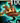

# LoL-QCastDetector

A Python tool that leverages **K-Means clustering** and **dominant color analysis** to detect when the Q ability is cast in a League of Legends VOD.  
By analyzing the small HUD region where the Q ability icon is displayed, the script automatically identifies state changes and **generates short gameplay clips** for every detected Q cast — with no manual video scrubbing.

---

## How it Works

1. **Pass 1 – Color Clustering**  
   - Extracts a **Region of Interest (ROI)** from every frame (either pixel or normalized coordinates).  
   - Computes the **mean BGR color** of each ROI.  
   - Uses **K-Means clustering** (`k=4` by default) to group frames into color-state clusters.
   - Saves:
     - Color swatches for each cluster (`cluster_colors/cluster_{i}_color.png`)
     - Example ROI frame for each cluster (`debug_rois/roi_{frame}_{time}_cluster{i}_example.png`)
   - Cluster meaning example:
     - Cluster 0 → "No mana"
     - Cluster 1 → "Q ready"
     - Cluster 2 → **"Q just cast"** (trigger)
     - Cluster 3 → "CC’d"

2. **Pass 2 – Trigger Detection**  
   - Select the trigger cluster manually (`--trigger-cluster`) or automatically (`--trigger-rgb`).  
   - Iterates through frames and extracts the **dominant color** in the ROI using **K-Means in RGB space** (`dom_k=3`).  
   - Computes **ΔE2000 color distance** between the frame's dominant color and the trigger cluster center.  
   - Fires a trigger if ΔE ≤ threshold (`--deltaE`), ensuring:
     - ROI at trigger and ROI +2s saved
     - A **clip** is written from 2 seconds before to 3 seconds after trigger (5s total)
     - Trigger events logged in `events.csv`

---

## Screenshots

**General League of Legends Gameplay:**  


**ROI (Region of Interest):**  


---

## Example Cluster Outputs

| Cluster ID | Example ROI | Swatch | Meaning (example)          |
|------------|-------------|--------|----------------------------|
| 0 |  |  | No mana – spell unavailable |
| 1 |  |  | Q ready but unused |
| 2 |  |  | **Q just cast** (blue highlight) |
| 3 |  |  | CC’d – can’t cast |

---

## Debug ROI Examples

  
  
  
  
  
  

---
## How Trigger Detection Works

The detection system not only clusters the average ROI colors using **K-Means**, but also continuously monitors the **dominant color** in the ROI during Pass 2.

**Color-space proximity check:**  
The script converts colors to Lab space (perceptually uniform) and calculates the **ΔE2000** distance from the trigger cluster center.  
Triggers only occur if the dominant color is **closest to the trigger cluster** and within the ΔE threshold — avoiding false positives from similar colors in other clusters.

**Visualization:**  
  

The plot shows:
- Each cluster center (C0–C3) in Lab a–b space.
- Background regions colored by nearest cluster.
- A random frame’s dominant color (star) and its distance to each cluster.


**Console Log Example:**  
  
The console output demonstrates:
- Periodic `[STATUS]` updates showing the dominant color for the ROI.
- `[TRIGGER]` messages when the dominant color matches the trigger cluster within ΔE.
- `[CLIP]` messages confirming 5-second clips saved around each trigger.
## Installation

```bash
pip install opencv-python numpy scikit-learn scikit-image colormath pytube
```
# Basic run with YouTube
```bash
python lol_q_detector.py \
  --youtube "https://www.youtube.com/watch?v=XXXXXXXXXXX" \
  --roi "0.500,0.612,0.520,0.635" \
  --out outputs/match1
# ROI can be pixels ("540,662,560,685") or normalized ("0.500,0.612,0.520,0.635")
```
# Option A – Manual selection
```bash
python lol_q_detector.py \
  --video outputs/match1/video_XXXXXXXXXX.mp4 \
  --roi "0.500,0.612,0.520,0.635" \
  --out outputs/match1 \
  --trigger-cluster 2
```
# Option B – Auto-pick closest to an RGB value
```bash
python lol_q_detector.py \
  --video outputs/match1/video_XXXXXXXXXX.mp4 \
  --roi "0.500,0.612,0.520,0.635" \
  --out outputs/match1 \
  --trigger-rgb "95,70,39"
```
# Outputs
```bash
# outputs/match1/
#   video_*.mp4
#   cluster_colors/
#     cluster_0_color.png
#     cluster_1_color.png
#     cluster_2_color.png
#     cluster_3_color.png
#   debug_rois/
#     roi_<frame>_<time>_cluster{i}_example.png
#     roi_<frame>_<time>_trigger.png
#     roi_<frame+2s>_<time>_trigger_plus2s.png
#     debug_roi_*.png
#   clips/
#     clip_0.mp4
#     clip_1.mp4
#     clip_2.mp4
#     ...
#   events.csv
```
# Tuning
```bash
# --clusters (default 4)
# --deltaE (default 10)
# --dom-k (default 3)
# --refractory (default 2s)
# --pre / --post (default 2s / 3s)
```
# Known Assumptions
# - The HUD Q-slot must remain inside the defined ROI for the entire video.
# - Detection is based purely on pixel color changes, not on actual in-game event logs or mechanics.

# License
# MIT

